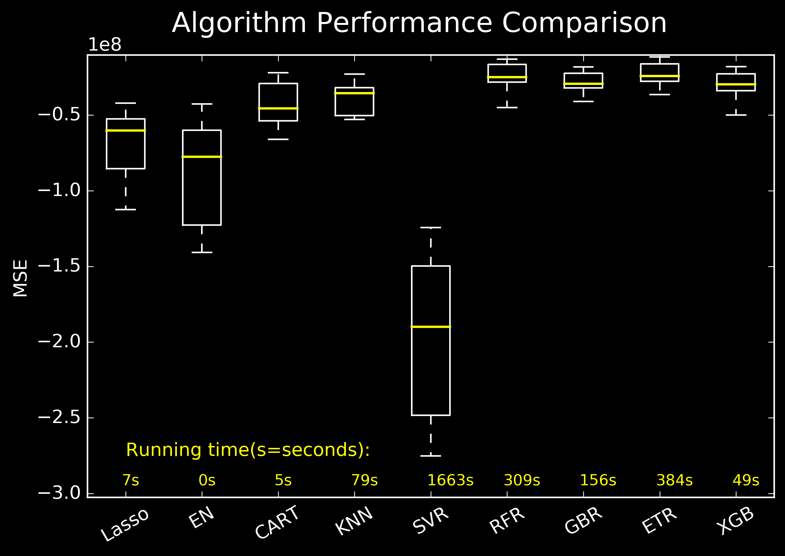

# Car Prices Estimator: An End-to-End Project

[See full project code here.](https://nbviewer.jupyter.org/github/EnriqueSPR/second_hand_cars_project/blob/main/car_price_project.ipynb)

**Description**: An end-to-end project in which I scrape , prepare, analyse the data and find a model to predict second hard prices cars in Spain.

**Summary of the project**:

1) I **scraped 40000 second hand cars** from [Milanuncios](https://www.milanuncios.com/coches-de-segunda-mano/?fromSearch=1&orden=relevance&pagina=1). One of the most famous second-hand online pages in Spain. 🚗🚓🚕💨

2) **Cleaned** and **prepared the data**. 🔄

3) **Analyzed the data** to answer questions such, in what cities can we find the best deals? or What models are most popular or reliable? 📈📊

4) Trained an algo to **predict the price** of second hand cars. **Score = 0.93**. 💲

# Code and Resources Used

**Python Version**: 3.7

**Packages**: pandas, numpy, datetime, re, requests, csv, sklearn, matplotlib, seaborn, plotly, pickle and json.

# 1. Scrapping Data.

### 1.1 I scraped the **title, location, description, link (url), km, year, gear, horse, price** from each add.
### 1.2 I further scraped the **fuel, seller, full_description and date of add publication** using the previously scrapped urls.
These info was obtained from over **40000 car adds**.

# 2. Feature Engineering and Data Cleaning.

### 2.1 Feature Engineering.
  * Description Len
  * km/year
  * years old car
  * Parse Location
  * Parse Brand
  * Parse Model 
  * Spain Region (Comunidad Autonoma) -> To obtained info about each spanish region I used another dataset. [Downloaded here](https://www.businessintelligence.info/varios/longitud-latitud-pueblos-espana.html)
  * Brand class based on price
  * Car class based on price
  
### 2.2 Data cleaning.

This dataset needed some cleaning since it contained some adds:
  * For rental
  * For buying (not selling)
  * Selling Car pieces
  * Offering car services
  
The information from the **full_description** was important for these cleaning steps.

# 3. Exploratory Data Analyses
Main questions to answer:

   * **What regions in Spain sells the cheaper/ most expensive cars**? -> Map it. 
   Using the **longitud** and **latitud** region data I plotted the areas where cars adds have been published using **plotly**. 
   The area of the circles is proportional to the **number of adds**, whereas the color gives us information of the median **car prices**. 
   
    
   
   * Study what variables correlate best with the median price among spanish regions. The age of the car showed the strongest corr. R2= 0.6
   
    
   
   * What models are more **popular** and **reliable** based on the age and km. For this I used a 3D plot which showed:
      * **Mercedes Benz** Models 190 and 300, **Peugot 306** and **Nissan Patrol** have the largest number of adds among the oldest and most used cars, which indicates they are reliable models. 
      * **CitroenC3, Citroen Celysee, Opel Corsa**, **Fiat Typo**, **Kia Ceed, Kia Picanto** seemed to be some of the most economical models (low price, low km, low year)
 
    
   
   * Look for some good offers. For this I also used a 3D plot but instead of plotting brands or models, I plotted the individual adds.
   
    
   
   * **Feature Selection** for the model. Look for correlations.
   
    
   
   For training a model capable of predicting car price(€) I chose the the best correlating features:
   
   **horse_power, years_old, km, doors, description_len, gear_bool, seller_bool, fuel_bool, region, and brand**.
   
   # 4. Data Split and Data Preprocessing:
   
   * Data was splitteed using **StratifiedShuffleSplit** to guarantee an even distribution after splitting the data. Test size chosen was 20%.
   
   
   
   * **Standarization** was performed using **StandardScaler()** on the train set, and the scaler was then used on the test set (only on the no-dummy variables).
   This helped minimizing the differences of scale among variables, hence resulting in better modeling.
   
   # 5. Exploring Model Performance:
   
   * Model performace of a variety of regression algorithms (Lasso,Elastic Net, Decision Tree Regressor,K Neighbors Regressor, Support Vector Machine Regressor, 
Random Forest Regressor, Gradient Boosting Regressor, ExtraTreesRegressor and Xtreme Gradient Boost Regressor) 
was assessed using **cross-validation** with 10 splits, and **negative mean squared error** as performance metric.

   
   
   # 6. Fine Tunning and Model Evaluation:
   
   * The ETR model was fine tunned using GridSearchCV. The following hyperparameters were optimized to maximiza the model performance in both the train and test set while avoiding overfitting:
    * n_estimators
    * max_depth
    * min_samples_leaf
    * min_samples_split
    
 * **Score**: The model ExtraTreesRegressor(n_estimators=100, max_depth=16, min_samples_leaf=4, min_samples_split=2) allowed to predict the **car price** 
 with a score of **0.93** on both the train and test set.
 
 
 
 # 7. Model usage:
 
 The model was used to see what features had a larger impact on the price prediction (feature importance) and to predict price fluctuations as the cars get older (See below)
 
  
 
 * The model was saved as a **pickle** file for its use.
 
 # 8. Productionization

In this step, I built a flask API endpoint that was hosted on a local webserver. The API endpoint takes in a request with the list of car related parameters and returns the estimated selling second hand price. A website that makes use of the model prediction was also created (See the app interface below).

 

   
   
